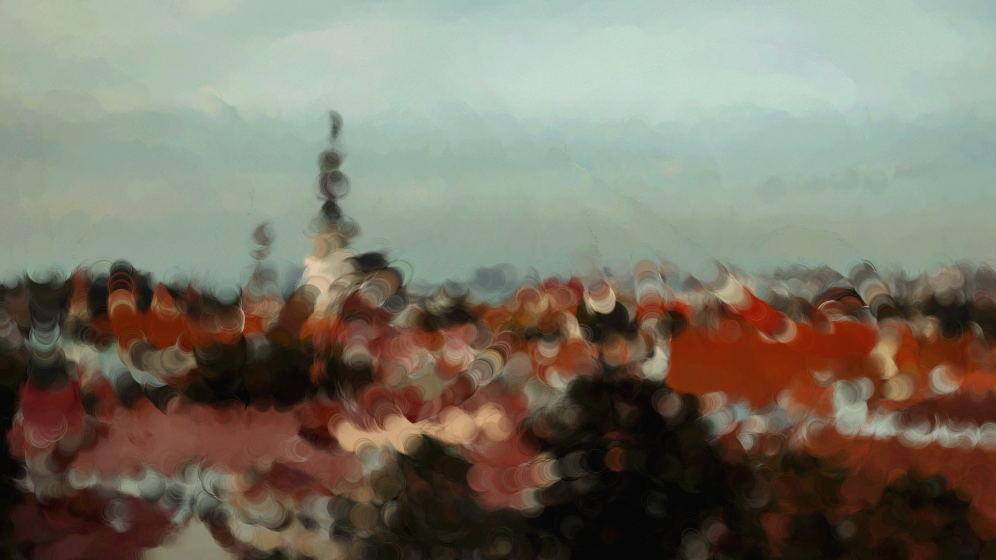
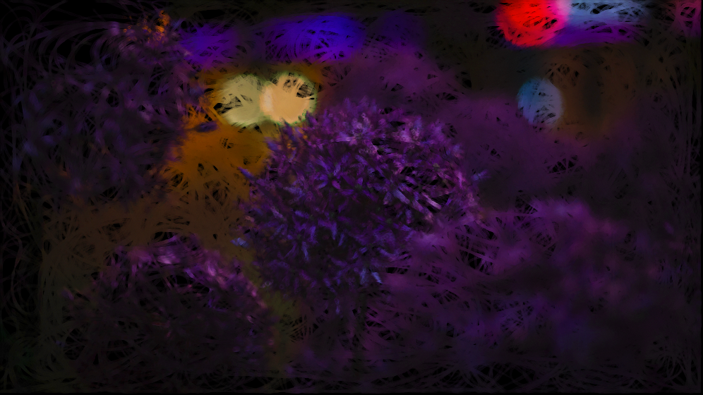
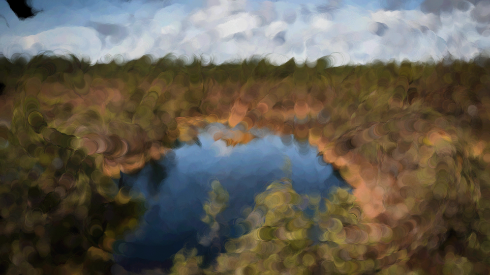

## Vine Brush

インポートした画像を蔦のような筆跡で描画するProcessingプロジェクトです。

### Download Processing

https://processing.org/download

###　How to use

| 入力キー | 動作                                   |
| :------- | :------------------------------------- |
| 0        | 描画をリセットします。                 |
| 1        | 蔦のような筆跡で画像を描画します。     |
| 2        | 太めの筆跡で画像を描画します。         |
| s        | 画像を`dist`ディレクトリに保存します。 |

### Gallery

